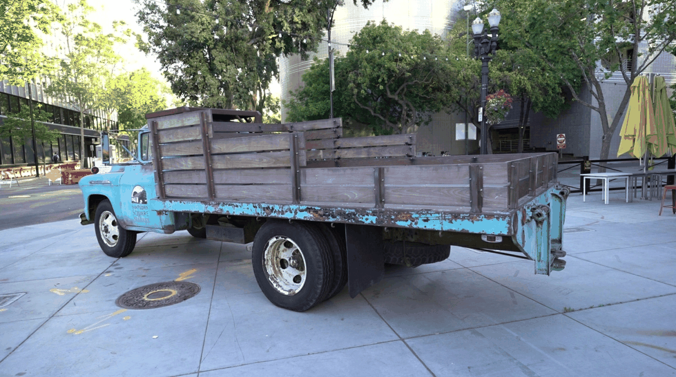
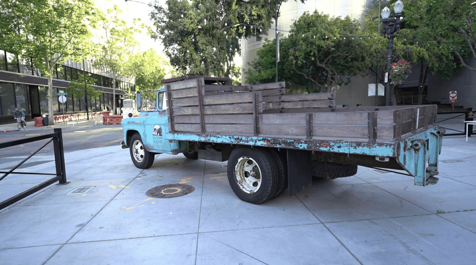
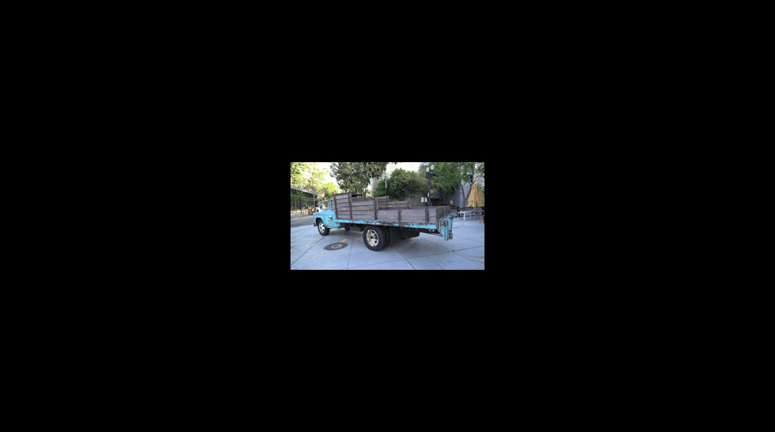
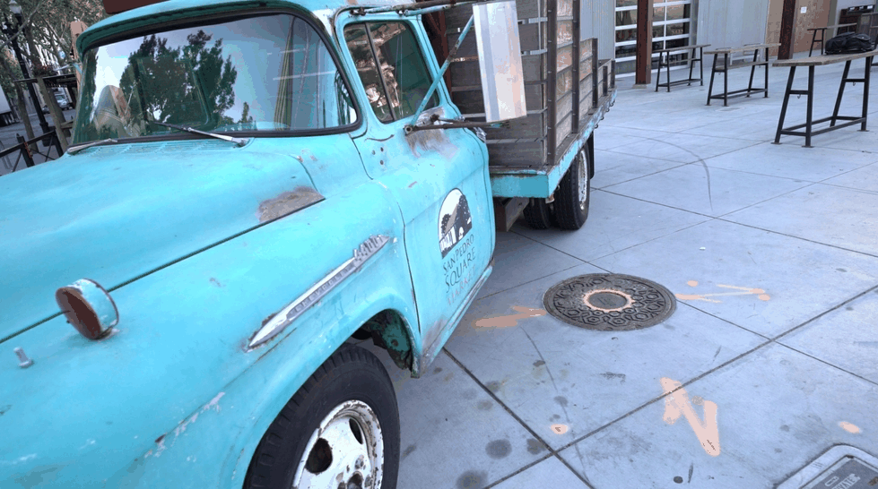

## Project Overview

This repository contains experiments and visualizations for a 3D reconstruction
project based on Gaussian Splatting. In addition to quantitative evaluation,
we provide animated qualitative comparisons to better illustrate differences
in Gaussian density, training convergence, and view coverage.

- 📄 Report: `report/`
- 📓 Notebooks: `notebooks/`
- 🎞️ Animated visualizations: `media/gifs/`

---

### 🎞️ Animated Qualitative Comparisons
#### Scene 00000 — GT ↔ Reconstruction Toggle

| Configuration | Animation |
|--------------|-----------|
| run_3000 |  |
| run_10000 |  |
| run_20000 |  |
| run_30000 |  |
| run_40000 |  |
| run_densify_10k |  |
| run_densify_full |  |
| run_few_gaussians |  |
| run_many_gaussians |  |
| run_fewviews_30000 |  |
| run_r2_30000 |  |
| run_r8_30000 |  |

#### 🎞️ Scene 00019 — GT ↔ Reconstruction Toggle

| Configuration | Animation |
|--------------|-----------|
| run_3000 |  |
| run_10000 |  |
| run_20000 |  |
| run_30000 |  |
| run_40000 |  |
| run_densify_10k |  |
| run_densify_full |  |
| run_few_gaussians |  |
| run_many_gaussians |  |
| run_fewviews_30000 |  |
| run_r2_30000 |  |
| run_r8_30000 | 

The animations toggle between the ground-truth image and the reconstructed view
for the same camera pose. They highlight differences in texture sharpness,
surface stability, and view-dependent effects across training duration,
densification strategies, resolution, and camera coverage.
