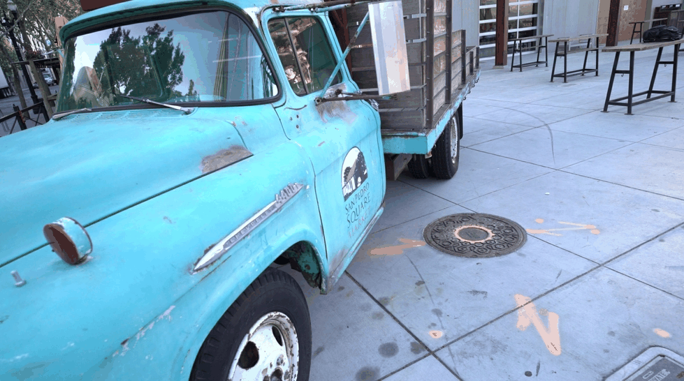

## Project Overview

This repository contains experiments and visualizations for a 3D reconstruction
project based on Gaussian Splatting. In addition to quantitative evaluation,
we provide animated qualitative comparisons to better illustrate differences
in Gaussian density, training convergence, and view coverage.

- 📄 Report: `report/`
- 📓 Notebooks: `notebooks/`
- 🎞️ Animated visualizations: `media/gifs/`

---

### Effect of Training Duration

| Training type | Scene 1 | Scene 2 |
|---------------|---------|---------|
| After 40K iterations |  |  |
